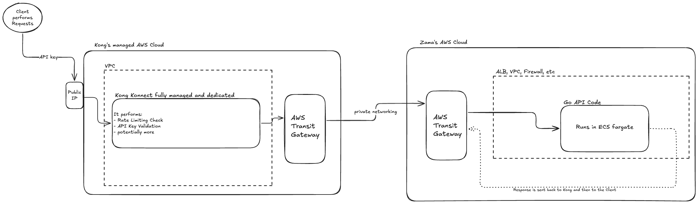

# Zama API Platform Challenge

A production-ready API platform demonstrating DevOps and SRE best practices. Built with Go, Kong, AWS ECS Fargate, and comprehensive observability.

## 📋 Overview

This project implements a simple HTTP API service with enterprise-grade infrastructure, security, and monitoring capabilities. The platform showcases:

- **Go API Service**: RESTful API with health checks and sum calculation endpoint
- **Kong API Gateway**: 100% SaaS: API Authentication, rate limiting, and API management
- **AWS Infrastructure**: ECS Fargate with auto-scaling, load balancing, and security
- **Observability**: CloudWatch monitoring, dashboards, and alerting
- **CI/CD**: GitHub Actions for automated testing and deployment
- **Security**: API key authentication, secrets management, network isolation, vuln scanning

## 🎥 Demo Videos

- **[Kong API Keys and Rate Limiting](https://youtu.be/5mUnUrbfUfM)**: Demonstrates API key authentication and rate limiting configuration
- **[With and Without Kong](https://youtu.be/Q4M9qjpq630)**: Shows the difference between direct API access and Kong-proxied requests
- **[Kong Offerings and Security Reflections](https://youtu.be/b5qWpn9_UqU)**: Discussion of Kong's security features and architectural decisions
- **[GitHub Actions CI/CD](https://youtu.be/yF2o0mOHr5c)**: CICDs Walkthrough

## 🏗️ Architecture
### Current architecture:
👉Very basic flow of the requests:


👉Terraform Graph of current arch ([see file](./terraform/terraform_graph.png)):


👉Comprehensive current AWS arch: [click here](./terraform/INFRASTRUCTURE.md)

### Components (current arch):

- **Client**: External users making API requests to Kong's endpoint
- **Kong Konnect**: Serverless API gateway (SaaS) handling authentication and rate limiting, authorizes or not the trafic to AWS
- **AWS ALB**: Application Load Balancer distributing traffic to ECS tasks
- **ECS Fargate**: Container orchestration running the Go API service
- **CloudWatch**: Comprehensive monitoring, logging, and alerting
- **GitHub Actions**: CI/CD pipeline for automated deployments

### Desired architecture:

After some trials and erros **i designed a new architecture that is better** than the one i deployed for the challenge:

👉Desired architecture (no public IP):


It seems better because on this one Zama has zero public exposure end-to-end.
The problem with the current one (using serverless kong) is that we are forced to expose the backend to the internet (even if locked down by headers/mTLS).


## 📁 Project Structure

```
.
├── .github/                          # GitHub Actions CI/CD workflows
│   └── workflows/
│       ├── ci.yml                   # Continuous integration
│       ├── deploy.yml               # AWS deployment pipeline
│       ├── docker.yml               # Docker build and push
│       ├── kong-konnect-test.yml    # Kong integration tests
│       ├── security-validation.yml  # Security scanning
│       ├── status.yml               # Status checks
│       └── terraform.yml            # Infrastructure validation
├── api-go-service/                  # Go API application
│   ├── cmd/server/                  # Application entry point
│   ├── internal/                    # Private application code
│   │   ├── config/                  # Configuration management
│   │   ├── handlers/                # HTTP request handlers
│   │   ├── middleware/              # HTTP middleware
│   │   ├── models/                  # Request/response models
│   │   └── server/                  # Server setup and routing
│   ├── pkg/logger/                  # Shared logging utilities
│   ├── Dockerfile                   # Container definition
│   ├── Makefile                     # Build automation
│   └── README.md                    # API service documentation
├── config/                          # Configuration files
│   ├── dev/                         # Development environment configs
│   ├── kong/                        # Kong configuration
│   └── local/certs/                 # Local SSL certificates
├── docs/                            # Project documentation
│   ├── images/                      # Architecture diagrams
│   ├── kong-docs/                   # Kong reference documentation
│   ├── zama-challenge-docs/         # Challenge requirements
│   └── SIMPLIFIED_MONITORING.md    # Monitoring overview
├── monitoring/                      # CloudWatch configuration
│   ├── alerts.json                  # Alert definitions (doc for ref)
│   └── dashboard.json               # Dashboard configuration (doc for ref)
├── scripts/                         # Deployment and utility scripts
│   ├── deploy-terraform.sh          # Infrastructure deployment
│   ├── setup-terraform-backend.sh   # Terraform s3 state setup
│   └── test-endpoints.sh            # API testing script
├── terraform/                       # Infrastructure as Code
│   ├── environments/dev/            # Environment-specific configs
│   │   ├── networking/              # VPC, subnets, security groups
│   │   ├── secrets/                 # AWS Secrets Manager
│   │   ├── observability/           # CloudWatch, alarms, SNS
│   │   └── compute/                 # ECS, ALB, auto-scaling
│   ├── modules/                     # Reusable Terraform modules
│   │   ├── networking/              # Networking module
│   │   ├── compute/                 # Compute module
│   │   └── observability/           # Monitoring module
│   ├── INFRASTRUCTURE.md            # Comprehensive infrastructure docs
│   ├── plan.txt                     # Terraform plan output
│   └── terraform_graph.png          # Infrastructure dependency graph
├── LICENSE                          # Project license
└── README.md                        # This file
```

## 🚀 About the custom API Go app

👉 See [this README](./api-go-service/README.md)


## 🌐 Deployment

### Infrastructure Deployment

👉Comprehensive AWS architecture: [click here](./terraform/INFRASTRUCTURE.md)

👉See the plan.txt that contains the terraform commands outputs: [click here](./terraform/plan.txt)


The platform uses Terraform with separated state files for better isolation:

1. **Setup Terraform Backend**:

   ```bash
   cd scripts
   chmod +x setup-terraform-backend.sh
   ./setup-terraform-backend.sh
   ```

2. **Deploy All Infrastructure**:

   ```bash
   chmod +x deploy-terraform.sh
   ./deploy-terraform.sh
   ```

   This deploys modules in dependency order:
   - `networking` → VPC, subnets, security groups
   - `secrets` → AWS Secrets Manager with API keys
   - `observability` → CloudWatch dashboards, alarms, SNS
   - `compute` → ECS Fargate, ALB, auto-scaling

3. **Manual Terraform Deployment**:

   ```bash
   cd terraform/environments/dev   
   cd networking && terraform init && terraform apply
   cd ../secrets && terraform init && terraform apply
   cd ../observability && terraform init && terraform apply
   cd ../compute && terraform init && terraform apply
   ```

## 🧪 Testing Commands

### Testing Kong API Gateway:

#### Rate Limiting Test
Test the rate limiting functionality (should hit the limit after several requests):
```bash
for i in {1..11}; do                                                                                           
curl http://kong-4994957fd2euqcpzn.kongcloud.dev/healthz
done
```

#### API Authentication Test:
Test with valid API key:
```bash
curl http://kong-4994957fd2euqcpzn.kongcloud.dev/api/v1/sum \
  -H 'Content-Type: application/json' \
  -d '{"numbers": [1, 2, 3, 4, 5]}' \
  -H "test-user-bob:BOB-API-KEY-123"
```

Test without API key (should fail with 401):
```bash
curl http://kong-4994957fd2euqcpzn.kongcloud.dev/api/v1/sum \
  -H 'Content-Type: application/json' \
  -d '{"numbers": [1, 2, 3, 4, 5]}'
```

### Testing Direct AWS Endpoint:

#### Direct API Access (bypassing Kong)
Test the API service directly through AWS ALB:
```bash
curl -X POST http://zama-api-platform-dev-alb-418928923.eu-west-1.elb.amazonaws.com:8080/api/v1/sum \
  -H 'Content-Type: application/json' \
  -d '{"numbers": [1, 2]}'
```

#### Health Check Test:
```bash
curl http://zama-api-platform-dev-alb-418928923.eu-west-1.elb.amazonaws.com:8080/healthz
```

This script tests:
- ✅ Direct API service health checks
- ✅ Kong proxy functionality  
- ✅ API key authentication
- ✅ Rate limiting behavior
- ✅ Input validation
- ✅ Error handling

## Future Improvements

If given more time, the following enhancements would be valuable:

- Put in place the Developer portal (Kong offers that): Set up a proper IdP like Auth0 or Keycloak on this developer portal for OIDC (enforce MFA in Auth0); implement JWT validation, API key self-service for developers ; Usage analytics and quota management
-  SLO definitions with Proper Metrics:  request duration histograms (not just averages), business metrics (API calls per developer, quota usage),  distributed tracing with AWS X-Ray
-  better alerting and monitoring stack: Distributed tracing,  Synthetic monitoring, better logs aggreg', in depth Performance testing
- turn the docker registry private or go for ECR
- replace AWS Secret manager with  Hashicorps Vault or similar stronger alternatives
- OIDC to avoid long lived aws account credentials used in GithubActions
- Comprehensive AWS IAMs
- Better protect AWS Root account (yubikeys etc)
- Better protect public IP AWS Endpoint using mTLS or Dedicated Kong instances
- I actually know a company that had to put in place a API layer and secure it, it is: https://www.dfns.co/ and i might be able to get feedback on the API tools they decided to go for.
- Put in place corporate security postures (zero trust networking, devices posture checks, JAMF, yubikeys, etc)
-  Review zama's DNS settings to prevent [DNS hijacks](https://www.bleepingcomputer.com/news/security/dns-hijacks-target-crypto-platforms-registered-with-squarespace/) and similar
-  improve security around the CICDs
-  Strong Multi-region deployment strategy
-  Circuit breaker pattern (on Kong side, and ALB side?)
-  the use of an external IdP different than the AWS identity (for our internal AWS IAM part i mean)
-  mTLS end to end
-  Automated rollback and Blue/green deployments
-  put in place disaster recovery procedures and incident response runbooks
-  dead man switch for the monitoring and alerting part (and add another monitoring Stack along the AWS's native one? (Prom/Grafana/AlertM, etc))
-  Set Kong config as Code and not from the web UI (i think that is not possible for serverless opiton i picked, but at least save CLI commands))


## 🤖 AI Coding Assistance

During this project, i used AI coding assistance (Cursor + Claude 4 Sonnet Max and ChatGPT5:

* I works wuite well to kick start and create files. 
* Must beware of outdated versions of modules/pkgs, CICDs GH actions modules etc.
* It works great at injesting large docs (used it a lot on Kong and AWS/terra docs) to find out are be the best tech/config choices to go for.
* great at generating REAMDE docs too

---
