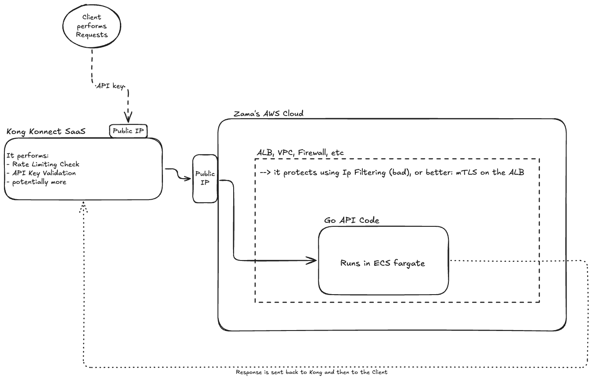
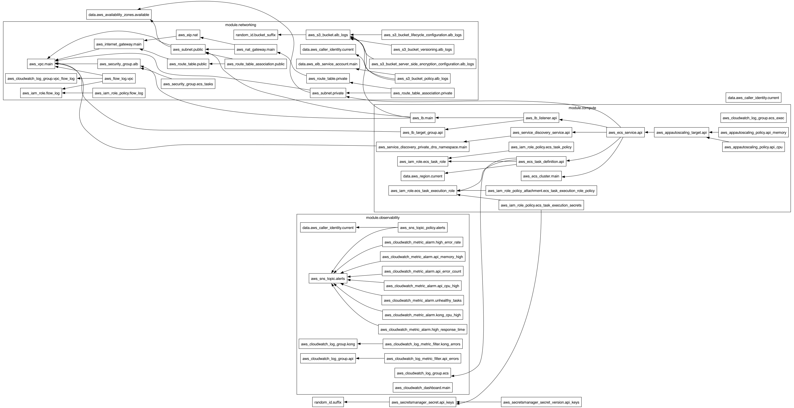

# Zama API Platform Challenge

A production-ready API platform demonstrating DevOps and SRE best practices. Built with Go, Kong, AWS ECS Fargate, and comprehensive observability.

## 📋 Overview

This project implements a simple HTTP API service with enterprise-grade infrastructure, security, and monitoring capabilities. The platform showcases:

- **Go API Service**: RESTful API with health checks and sum calculation endpoint
- **Kong API Gateway**: 100% SaaS: API Authentication, rate limiting, and API management
- **AWS Infrastructure**: ECS Fargate with auto-scaling, load balancing, and security
- **Observability**: CloudWatch monitoring, dashboards, and alerting
- **CI/CD**: GitHub Actions for automated testing and deployment
- **Security**: API key authentication, secrets management, and network isolation

## 🎥 Demo Videos

### Kong Configuration and Testing
- **[Kong API Keys and Rate Limiting](https://youtu.be/5mUnUrbfUfM)**: Demonstrates API key authentication and rate limiting configuration
- **[With and Without Kong](https://youtu.be/Q4M9qjpq630)**: Shows the difference between direct API access and Kong-proxied requests
- **[Kong Offerings and Security Reflections](https://youtu.be/b5qWpn9_UqU)**: Discussion of Kong's security features and architectural decisions

### CI/CD Pipeline
- **[GitHub Actions CI/CD](https://youtu.be/yF2o0mOHr5c)**: CICDs Walkthrough

## 🏗️ Architecture
👉Very basic request flow:



👉Terraform Graph([see file](./terraform/terraform_graph.png)):




👉Comprehensive AWS architecture: [click here](./terraform/INFRASTRUCTURE.md)


### Components

- **Client**: External users making API requests to Kong's endpoint
- **Kong Konnect**: Serverless API gateway (SaaS) handling authentication and rate limiting, authorizes or not the trafic to AWS
- **AWS ALB**: Application Load Balancer distributing traffic to ECS tasks
- **ECS Fargate**: Container orchestration running the Go API service
- **CloudWatch**: Comprehensive monitoring, logging, and alerting
- **GitHub Actions**: CI/CD pipeline for automated deployments

### Key Design Decisions

- **ECS Fargate over EKS**: Reduced operational overhead for simple services
- **Kong Konnect (SaaS)**: Managed API gateway eliminating infrastructure management
- **Separated Terraform State**: Isolated state files for networking, secrets, observability, and compute
- **Multi-AZ Deployment**: High availability across multiple availability zones
- **Comprehensive Monitoring**: 12 CloudWatch alarms covering main failure scenarios

## 🚀 About the custom API Go app

👉 See [this README](./api-go-service/README.md)


## 🌐 Deployment

### Infrastructure Deployment

👉Comprehensive AWS architecture: [click here](./terraform/INFRASTRUCTURE.md)

👉See the plan.txt that contains the terraform commands outputs: [click here](./terraform/plan.txt)


The platform uses Terraform with separated state files for better isolation:

1. **Setup Terraform Backend**:

   ```bash
   cd scripts
   chmod +x setup-terraform-backend.sh
   ./setup-terraform-backend.sh
   ```

2. **Deploy All Infrastructure**:

   ```bash
   chmod +x deploy-terraform.sh
   ./deploy-terraform.sh
   ```

   This deploys modules in dependency order:
   - `networking` → VPC, subnets, security groups
   - `secrets` → AWS Secrets Manager with API keys
   - `observability` → CloudWatch dashboards, alarms, SNS
   - `compute` → ECS Fargate, ALB, auto-scaling

3. **Manual Terraform Deployment**:

   ```bash
   cd terraform/environments/dev   
   cd networking && terraform init && terraform apply
   cd ../secrets && terraform init && terraform apply
   cd ../observability && terraform init && terraform apply
   cd ../compute && terraform init && terraform apply
   ```

## Future Improvements

If given more time, the following enhancements would be valuable:

- private docker registry
- replace AWS Secret manager with  Hashicorps Vault or similar stronger alternatives
- OIDC to avoid long lived service account credentials used in GithubActions
- Comprehensive AWS IAMs
- Better protect AWS Root account
- Better protect public IP AWS Endpoint using mTLS or Dedicated Kong instances
- I actually know a company that had to put in place a API layer and secure it a long, it is: https://www.dfns.co/ and i know some of the tech stack they put in place
- Put in place corporate security postures (zero trust networking, devices posture checks etc)
-  make sure the settings on the DNS provider side are very restricted
-  improve security around the CICDs
-  better alerting and monitoring stack: Distributed tracing, ustom business metrics, Synthetic monitoring, better logs aggreg', in depth Performance testin.
-  Multi-region Docker deployment
-  AWS WAF?
-  Circuit breaker pattern (on Kong side)
-  the use of an external IdP different than the AWS one
-  mTLS end to end
-  Automated rollback and Blue/green deployments
-  put in place disaster recovery procedures and incident response runbooks
-  dead man switch for the monitoring and alertign part (and move out of AWS's suite ?)


## 🤖 AI Coding Assistance

* During this project, AI coding assistance (Cursor + Claude 4 Sonnet Max and ChatGPT5.
* I works wuite well to kick start and create files. 
* Must beware of outdated versions of modules/pkgs, CICDs GH actions etc.
* It works great at injesting large docs (used it a lot on Kong and AWS/terra docs.

---
