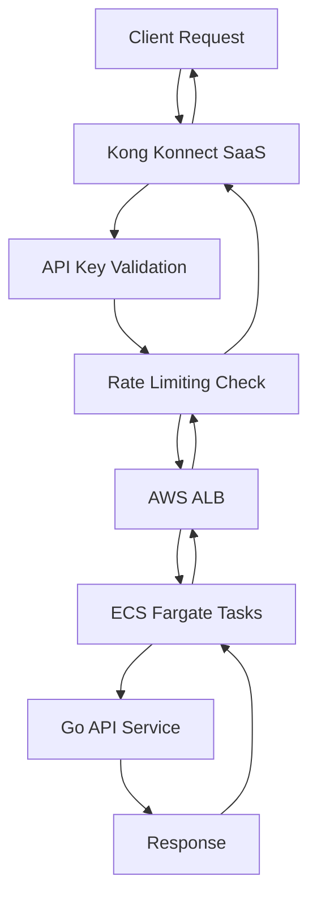
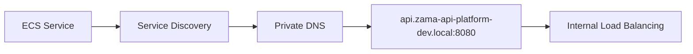
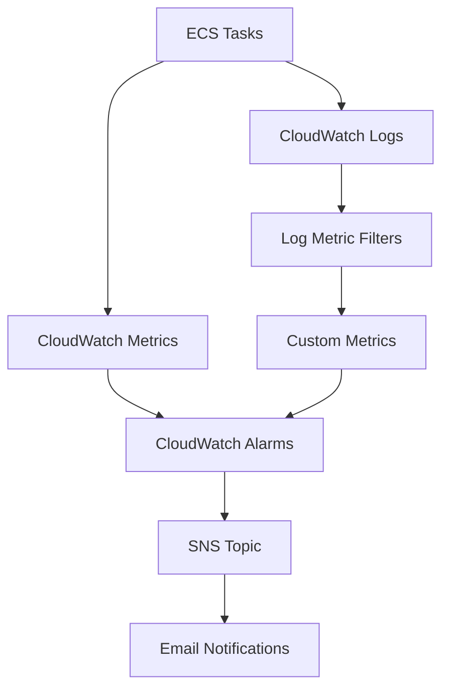
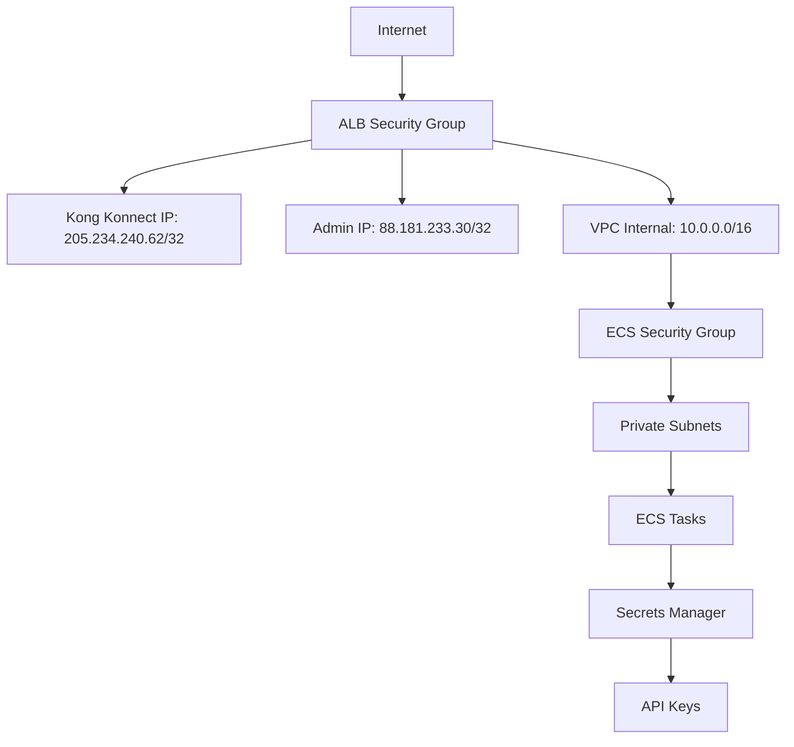

# Zama API Platform - Infrastructure Architecture

## 🏗️ Complete Infrastructure Overview

This document provides a comprehensive breakdown of all AWS resources and components that make up the Zama API Platform infrastructure, deployed using Terraform with a modular, separated state file approach.

## 📊 Infrastructure Summary

| Category | Count | Key Services |
|----------|-------|--------------|
| **Networking** | 23 resources | VPC, Subnets, NAT Gateways, Security Groups |
| **Compute** | 15 resources | ECS Fargate, ALB, Auto Scaling |
| **Observability** | 17 resources | CloudWatch, SNS, Alarms |
| **Security** | 8 resources | Secrets Manager, IAM Roles |
| **Total** | **63 AWS resources** | Across 4 isolated modules |

## 🎯 Architecture Principles

### Modular Design with Separated State Files
- **4 Independent Modules**: Each with isolated Terraform state files
- **Reduced Blast Radius**: Changes in one module don't affect others
- **Parallel Development**: Teams can work on different components simultaneously
- **Selective Deployments**: Update only specific infrastructure components

### High Availability & Resilience
- **Multi-AZ Deployment**: Resources distributed across 2 availability zones
- **Auto Scaling**: Automatic scaling based on CPU/Memory utilization
- **Health Monitoring**: Comprehensive health checks at multiple levels
- **Graceful Degradation**: Isolated failures don't cascade

## 📋 Complete Resource Inventory

### 1. Networking Module (23 Resources)
*State File: `s3://bucket/networking/terraform.tfstate`*

#### Core Networking (9 Resources)
| Resource | Type | Purpose |
|----------|------|---------|
| `aws_vpc.main` | VPC | Main network isolation (10.0.0.0/16) |
| `aws_internet_gateway.main` | Internet Gateway | Internet access for public subnets |
| `aws_subnet.public[0-1]` | Public Subnets | 2x subnets for ALB (10.0.1.0/24, 10.0.2.0/24) |
| `aws_subnet.private[0-1]` | Private Subnets | 2x subnets for ECS tasks (10.0.10.0/24, 10.0.20.0/24) |
| `aws_eip.nat[0-1]` | Elastic IPs | Static IPs for NAT gateways |
| `aws_nat_gateway.main[0-1]` | NAT Gateways | Outbound internet for private subnets |

#### Routing (6 Resources)
| Resource | Type | Purpose |
|----------|------|---------|
| `aws_route_table.public` | Route Table | Routes traffic to Internet Gateway |
| `aws_route_table.private[0-1]` | Route Tables | Routes traffic to NAT Gateways |
| `aws_route_table_association.public[0-1]` | Associations | Links public subnets to public route table |
| `aws_route_table_association.private[0-1]` | Associations | Links private subnets to private route tables |

#### Security Groups (2 Resources)
| Resource | Type | Purpose |
|----------|------|---------|
| `aws_security_group.alb` | ALB Security Group | Controls inbound traffic to load balancer |
| `aws_security_group.ecs_tasks` | ECS Security Group | Controls traffic to ECS containers |

#### Logging & Monitoring (6 Resources)
| Resource | Type | Purpose |
|----------|------|---------|
| `aws_s3_bucket.alb_logs` | S3 Bucket | Stores ALB access logs |
| `aws_s3_bucket_versioning.alb_logs` | S3 Config | Enables versioning for logs |
| `aws_s3_bucket_server_side_encryption_configuration.alb_logs` | S3 Config | Encrypts logs at rest |
| `aws_s3_bucket_lifecycle_configuration.alb_logs` | S3 Config | Auto-deletes old logs (30 days) |
| `aws_s3_bucket_policy.alb_logs` | S3 Policy | Allows ALB to write logs |
| `aws_cloudwatch_log_group.vpc_flow_log` | CloudWatch | VPC flow logs storage |
| `aws_flow_log.vpc` | VPC Flow Log | Network traffic monitoring |
| `aws_iam_role.flow_log` | IAM Role | Permissions for VPC flow logs |
| `aws_iam_role_policy.flow_log` | IAM Policy | CloudWatch write permissions |

#### Network Security Configuration
```hcl
# ALB Security Group Rules
- Kong Konnect Cloud: 205.234.240.62/32:8080 (Kong's IP)
- Management Access: 88.181.233.30/32:8080 (Admin IP)
- Health Checks: VPC CIDR:8080 (Internal health checks)
- All Outbound: 0.0.0.0/0 (Unrestricted egress)

# ECS Tasks Security Group Rules
- HTTP from ALB: ALB SG → ECS:8080
- Kong Gateway: ALB SG → ECS:8000
- Kong Admin: ALB SG → ECS:8001
- Inter-service: Self-referencing rule
- All Outbound: 0.0.0.0/0
```

### 2. Compute Module (15 Resources)
*State File: `s3://bucket/compute/terraform.tfstate`*

#### ECS Cluster & Services (4 Resources)
| Resource | Type | Purpose |
|----------|------|---------|
| `aws_ecs_cluster.main` | ECS Cluster | Container orchestration cluster |
| `aws_ecs_service.api` | ECS Service | Manages API container instances |
| `aws_ecs_task_definition.api` | Task Definition | API container specifications |
| `aws_cloudwatch_log_group.ecs_exec` | CloudWatch | ECS exec session logs |

#### Service Discovery (2 Resources)
| Resource | Type | Purpose |
|----------|------|---------|
| `aws_service_discovery_private_dns_namespace.main` | Service Discovery | Private DNS namespace |
| `aws_service_discovery_service.api` | Service Discovery | API service registration |

#### Load Balancing (4 Resources)
| Resource | Type | Purpose |
|----------|------|---------|
| `aws_lb.main` | Application Load Balancer | Traffic distribution |
| `aws_lb_target_group.api` | Target Group | API service targets |
| `aws_lb_listener.api` | ALB Listener | Routes traffic to API |

#### Auto Scaling (3 Resources)
| Resource | Type | Purpose |
|----------|------|---------|
| `aws_appautoscaling_target.api` | Auto Scaling Target | Defines scaling parameters |
| `aws_appautoscaling_policy.api_cpu` | Scaling Policy | CPU-based scaling (70% target) |
| `aws_appautoscaling_policy.api_memory` | Scaling Policy | Memory-based scaling (70% target) |

#### IAM Roles & Policies (4 Resources)
| Resource | Type | Purpose |
|----------|------|---------|
| `aws_iam_role.ecs_task_execution_role` | IAM Role | ECS task startup permissions |
| `aws_iam_role.ecs_task_role` | IAM Role | Runtime permissions for tasks |
| `aws_iam_role_policy_attachment.ecs_task_execution_role_policy` | Policy Attachment | AWS managed ECS policy |
| `aws_iam_role_policy.ecs_task_execution_secrets` | IAM Policy | Secrets Manager access |
| `aws_iam_role_policy.ecs_task_policy` | IAM Policy | CloudWatch logging permissions |

#### Container Configuration
```json
{
  "name": "api",
  "image": "flentier/demo-go-api-kong:latest",
  "cpu": 256,
  "memory": 512,
  "essential": true,
  "portMappings": [{"containerPort": 8080}],
  "healthCheck": {
    "command": ["CMD-SHELL", "curl -f http://localhost:8080/healthz || exit 1"],
    "interval": 30,
    "timeout": 5,
    "retries": 3,
    "startPeriod": 60
  },
  "environment": [
    {"name": "PORT", "value": "8080"},
    {"name": "GIN_MODE", "value": "release"},
    {"name": "LOG_LEVEL", "value": "info"},
    {"name": "LOG_FORMAT", "value": "json"}
  ]
}
```

### 3. Observability Module (17 Resources)
*State File: `s3://bucket/observability/terraform.tfstate`*

#### CloudWatch Log Groups (3 Resources)
| Resource | Type | Purpose |
|----------|------|---------|
| `aws_cloudwatch_log_group.ecs` | Log Group | ECS task logs (/aws/ecs/zama-api-platform-dev) |
| `aws_cloudwatch_log_group.api` | Log Group | API application logs |
| `aws_cloudwatch_log_group.kong` | Log Group | Kong gateway logs (future use) |

#### Monitoring Dashboard (1 Resource)
| Resource | Type | Purpose |
|----------|------|---------|
| `aws_cloudwatch_dashboard.main` | Dashboard | Real-time metrics visualization |

#### CloudWatch Alarms (12 Resources)

##### 🔴 Critical Alarms (Service Down)
| Alarm | Metric | Threshold | Purpose |
|-------|--------|-----------|---------|
| `no_healthy_targets` | HealthyHostCount | < 1 | **CRITICAL**: No healthy targets - service down |
| `unhealthy_tasks` | RunningTaskCount | < 1 | **CRITICAL**: No running ECS tasks |

##### 🟠 High Priority Alarms (Service Issues)
| Alarm | Metric | Threshold | Purpose |
|-------|--------|-----------|---------|
| `high_error_rate` | HTTPCode_Target_5XX_Count | > 10 | High 5XX error rate |
| `alb_unhealthy_targets` | UnHealthyHostCount | > 0 | Some health checks failing |
| `api_error_count` | Custom metric | > 5 | Application ERROR logs |
| `alb_connection_errors` | TargetConnectionErrorCount | > 5 | ALB connection failures |

##### 🟡 Medium Priority Alarms (Performance Issues)
| Alarm | Metric | Threshold | Purpose |
|-------|--------|-----------|---------|
| `high_response_time` | TargetResponseTime | > 2s | Slow API responses |
| `health_endpoint_slow_response` | TargetResponseTime | > 5s | Health endpoint slow |
| `low_request_count` | RequestCount | < 1 | No traffic (possible outage) |
| `api_cpu_high` | CPUUtilization | > 80% | High CPU usage |
| `api_memory_high` | MemoryUtilization | > 80% | High memory usage |
| `kong_cpu_high` | CPUUtilization | > 80% | Kong CPU usage (future) |

#### Alert Notification (2 Resources)
| Resource | Type | Purpose |
|----------|------|---------|
| `aws_sns_topic.alerts` | SNS Topic | Alert notification hub |
| `aws_sns_topic_policy.alerts` | SNS Policy | CloudWatch publish permissions |
| `aws_sns_topic_subscription.email_alerts` | SNS Subscription | Email notifications |

#### Custom Metrics (2 Resources)
| Resource | Type | Purpose |
|----------|------|---------|
| `aws_cloudwatch_log_metric_filter.api_errors` | Metric Filter | Counts ERROR logs in API |
| `aws_cloudwatch_log_metric_filter.kong_errors` | Metric Filter | Counts Kong errors (future) |

### 4. Secrets Module (8 Resources)
*State File: `s3://bucket/secrets/terraform.tfstate`*

#### Secrets Management
| Resource | Type | Purpose |
|----------|------|---------|
| `aws_secretsmanager_secret.api_keys` | Secret | Kong API keys storage |
| `aws_secretsmanager_secret_version.api_keys` | Secret Version | API key values |
| `aws_secretsmanager_secret.database_credentials` | Secret | Future database credentials |
| `aws_secretsmanager_secret.kong_konnect_config` | Secret | Kong Konnect API tokens |
| `aws_secretsmanager_secret_version.kong_konnect_config` | Secret Version | Kong configuration |
| `random_id.suffix` | Random ID | Unique naming suffix |

#### Secret Contents
```json
{
  "api_keys": {
    "api_key_demo": "your-demo-api-key"
  },
  "kong_konnect_config": {
    "kong_admin_token": "PLACEHOLDER_REPLACE_IN_CONSOLE",
    "kong_api_url": "PLACEHOLDER_REPLACE_IN_CONSOLE"
  }
}
```

## 🔄 Component Interactions & Data Flow

### 1. External Traffic Flow


### 2. Internal Service Discovery


### 3. Monitoring & Alerting Flow


### 4. Security & Access Control


## 📊 Resource Dependencies

### Module Dependencies
```
Networking (Independent)
    ↓
Secrets (Independent)
    ↓
Observability (Depends on: Networking)
    ↓
Compute (Depends on: Networking, Secrets, Observability)
```

### Critical Resource Dependencies
```
VPC → Subnets → Security Groups → ALB → Target Groups → ECS Service
                                    ↓
                           Service Discovery ← ECS Tasks
                                    ↓
                              CloudWatch Logs ← Log Groups
                                    ↓
                             CloudWatch Alarms → SNS → Email
```

## 🏗️ Infrastructure Characteristics

### High Availability Features
- **Multi-AZ Deployment**: Resources span 2 availability zones
- **Auto Scaling**: Automatic scaling between 1-5 instances
- **Health Checks**: Multiple layers of health monitoring
- **Load Balancing**: Traffic distribution across healthy instances
- **Graceful Degradation**: Isolated component failures

### Security Implementations
- **Network Isolation**: Private subnets for application workloads
- **Least Privilege IAM**: Minimal required permissions
- **Secrets Management**: Encrypted storage of sensitive data
- **Security Groups**: Layer 4 firewall rules
- **VPC Flow Logs**: Network traffic monitoring
- **Encrypted Storage**: S3 and Secrets Manager encryption

### Scalability Design
- **Horizontal Scaling**: Auto scaling based on CPU/Memory
- **Vertical Scaling**: Configurable CPU/Memory per task
- **Load Distribution**: ALB distributes traffic evenly
- **Service Discovery**: Dynamic service registration
- **Stateless Design**: No persistent storage dependencies

### Operational Excellence
- **Comprehensive Monitoring**: 12 CloudWatch alarms
- **Centralized Logging**: Structured JSON logs
- **Automated Alerts**: Email notifications for issues
- **Infrastructure as Code**: All resources defined in Terraform
- **Separated State**: Isolated state files for safer operations

## 🎯 Key Design Decisions

### Why ECS Fargate over EKS?
- **Lower Operational Overhead**: No control plane management
- **Faster Setup**: Simpler for demonstration purposes
- **Cost Effective**: Pay only for running tasks
- **AWS Native**: Better integration with AWS services

### Why Kong Konnect (SaaS) over Self-Hosted?
- **Zero Infrastructure**: No gateway infrastructure to manage
- **Built-in Analytics**: Real-time monitoring included
- **Enterprise Features**: Advanced policies out-of-the-box
- **High Availability**: SLA-backed availability

### Why Separated Terraform State?
- **Reduced Blast Radius**: Module isolation prevents cascading failures
- **Parallel Development**: Teams can work independently
- **Selective Updates**: Update only changed components
- **Better Security**: Sensitive secrets in isolated state

### Why Multi-AZ but Single Region?
- **High Availability**: Protection against AZ failures
- **Cost Optimization**: Single region reduces data transfer costs
- **Latency Optimization**: All resources in same region
- **Complexity Management**: Multi-region adds operational complexity

## 🔧 Operational Considerations

### Deployment Order
1. **Networking**: VPC, subnets, security groups
2. **Secrets**: API keys and configuration
3. **Observability**: Logging and monitoring setup
4. **Compute**: ECS services and load balancer

### Scaling Characteristics
- **Auto Scaling Triggers**: CPU > 70% or Memory > 70%
- **Scale Out Time**: ~2-3 minutes for new tasks
- **Scale In Time**: ~5 minutes (connection draining)
- **Maximum Capacity**: 5 instances per service

### Monitoring Coverage
- **Infrastructure**: ECS, ALB, VPC metrics
- **Application**: Custom error metrics from logs
- **Network**: VPC flow logs and ALB access logs
- **Security**: Failed authentication attempts
- **Performance**: Response times and throughput

### Backup & Recovery
- **State Files**: Versioned in S3 with lifecycle policies
- **Secrets**: 7-day recovery window in Secrets Manager
- **Logs**: 7-day retention for operational logs
- **Configuration**: Infrastructure as Code in Git

This infrastructure provides a robust, scalable, and secure foundation for the Zama API Platform, with comprehensive monitoring and operational excellence built in from the ground up.
