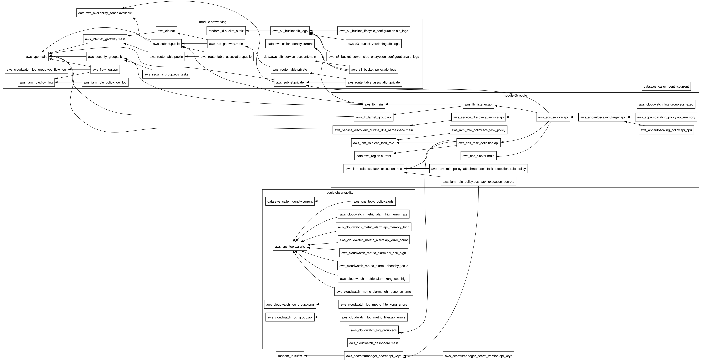

# Terraform Infrastructure - Zama API Platform

This repository contains Terraform infrastructure code for deploying a production-ready API platform on AWS using ECS Fargate with comprehensive monitoring and security controls.

> 📖 **Project Overview**: For complete project documentation, architecture decisions, and deployment workflows, see the main [Project README](../README.md).

## Architecture Overview

The infrastructure is designed with a **modular, separated state file approach** for better isolation and reduced blast radius:

```
┌─────────────────┐  ┌─────────────────┐  ┌─────────────────┐  ┌─────────────────┐
│   Networking    │  │    Secrets      │  │  Observability  │  │    Compute      │
│                 │  │                 │  │                 │  │                 │
│ • VPC/Subnets   │  │ • API Keys      │  │ • CloudWatch    │  │ • ECS Fargate   │
│ • Security Grps │  │ • Secrets Mgr   │  │ • Dashboards    │  │ • Load Balancer │
│ • NAT Gateways  │  │ • Kong Config   │  │ • Alarms/SNS    │  │ • Auto Scaling  │
└─────────────────┘  └─────────────────┘  └─────────────────┘  └─────────────────┘
```

**Terraform Dependency Graph:**



The graph above shows the complete dependency relationships between all Terraform resources across the four modules.

### Key Components

- **API Service**: Go application running on ECS Fargate
- **Kong Konnect**: Serverless API gateway (managed externally)
- **Networking**: Multi-AZ VPC with public/private subnets
- **Security**: AWS Secrets Manager, IAM roles, Security Groups
- **Monitoring**: CloudWatch dashboards, alarms, and logging
- **Load Balancing**: Application Load Balancer with health checks

## AWS Services Used

| Service | Purpose |
|---------|---------|
| **ECS Fargate** | Container orchestration for API service |
| **Application Load Balancer** | Traffic distribution and health checks |
| **VPC** | Network isolation with public/private subnets |
| **Secrets Manager** | Secure storage of API keys and configurations |
| **CloudWatch** | Logging, monitoring, dashboards, and alerting |
| **SNS** | Alert notifications |
| **S3** | ALB access logs and Terraform state storage |
| **DynamoDB** | Terraform state locking |
| **IAM** | Access control with least privilege policies |

## Directory Structure

```
terraform/
├── modules/                    # Reusable Terraform modules
│   ├── networking/            # VPC, subnets, security groups
│   ├── compute/               # ECS, ALB, auto-scaling
│   └── observability/         # CloudWatch, alarms, dashboards
├── environments/dev/          # Environment-specific configurations
│   ├── networking/           # Networking module instance
│   ├── secrets/              # Secrets module instance
│   ├── observability/        # Observability module instance
│   └── compute/              # Compute module instance
└── README.md                 # This file
```

## Quick Deployment

### Prerequisites
- AWS CLI configured with `platform-admin` profile
- Terraform >= 1.0 installed
- Appropriate AWS permissions

### 1. Setup Backend Infrastructure
```bash
cd scripts
chmod +x setup-terraform-backend.sh
./setup-terraform-backend.sh
```
This creates:
- S3 bucket for Terraform state (encrypted, versioned)
- DynamoDB table for state locking
- Proper IAM policies and lifecycle rules

### 2. Deploy All Infrastructure
```bash
chmod +x deploy-terraform.sh
./deploy-terraform.sh
```
This script:
- Deploys modules in dependency order: `networking` → `secrets` → `observability` → `compute`
- Uses isolated state files for each module
- Provides deployment summary with API endpoints

## State File Isolation

Each module maintains its own state file in S3:

```
s3://bucket-name/
├── networking/terraform.tfstate      # VPC, subnets, security groups
├── secrets/terraform.tfstate         # API keys, secrets
├── observability/terraform.tfstate   # Logging, monitoring
└── compute/terraform.tfstate         # ECS, ALB, auto-scaling
```

**Benefits:**
- **Reduced blast radius** - corruption in one state doesn't affect others
- **Parallel development** - teams can work on different components
- **Selective deployments** - update only specific components
- **Better security** - sensitive secrets isolated in separate state

## Manual Deployment

If you prefer step-by-step deployment:

```bash
# 1. Networking (no dependencies)
cd terraform/environments/dev/networking
terraform init && terraform plan && terraform apply

# 2. Secrets (no dependencies)
cd ../secrets
terraform init && terraform plan && terraform apply

# 3. Observability (depends on networking)
cd ../observability
terraform init && terraform plan && terraform apply

# 4. Compute (depends on all others)
cd ../compute
terraform init && terraform plan && terraform apply
```

## Configuration

### Key Variables
- `aws_region`: AWS region (default: eu-west-1)
- `aws_profile`: AWS CLI profile (default: platform-admin)
- `api_image_uri`: Docker image for API service
- `demo_api_key`: API key for Kong authentication

### Environment Variables
```bash
export AWS_PROFILE="platform-admin"
export AWS_REGION="eu-west-1"
```

## Security Features

- **Network Isolation**: ECS tasks in private subnets
- **Secrets Management**: API keys stored in AWS Secrets Manager
- **Least Privilege**: IAM roles with minimal required permissions
- **Audit Logging**: VPC Flow Logs and ALB access logs
- **Encryption**: All data encrypted at rest and in transit

## Monitoring & Alerting

- **CloudWatch Dashboard**: Real-time metrics and logs
- **Automated Alerts**: High error rates, response times, resource utilization
- **Custom Metrics**: Application error tracking
- **SNS Notifications**: Alert routing (configure email/Slack endpoints)

## Testing

After deployment, test the API:

```bash
# Health check
curl -X GET http://your-alb-dns:8080/healthz

# API endpoint
curl -X POST http://your-alb-dns:8080/api/v1/sum \
  -H 'Content-Type: application/json' \
  -d '{"numbers": [1,2,3,4,5]}'
```

## Kong Konnect Integration

Configure Kong Konnect to proxy to your ALB:
- **Service URL**: `http://your-alb-dns:8080`
- **Routes**: `/healthz` (public), `/api` (protected with API key)
- **Rate Limiting**: 100 requests/minute per API key

## Cleanup

To destroy infrastructure (in reverse order):
```bash
cd terraform/environments/dev/compute && terraform destroy
cd ../observability && terraform destroy
cd ../secrets && terraform destroy
cd ../networking && terraform destroy
```

## Support

- **Logs**: Check CloudWatch log groups `/aws/ecs/zama-api-platform-dev`
- **Metrics**: View CloudWatch dashboard `zama-api-platform-dev-dashboard`
- **State**: All state files stored in S3 with versioning enabled

## Additional Resources

- **📖 [Main Project README](../README.md)**: Complete project overview, API documentation, and deployment workflows
- **📋 [Detailed Deployment Guide](../docs/TERRAFORM_DEPLOYMENT_GUIDE.md)**: Step-by-step deployment instructions with troubleshooting
- **🏗️ [Architecture Documentation](../docs/ARCHITECTURE.md)**: Detailed system architecture and design decisions
